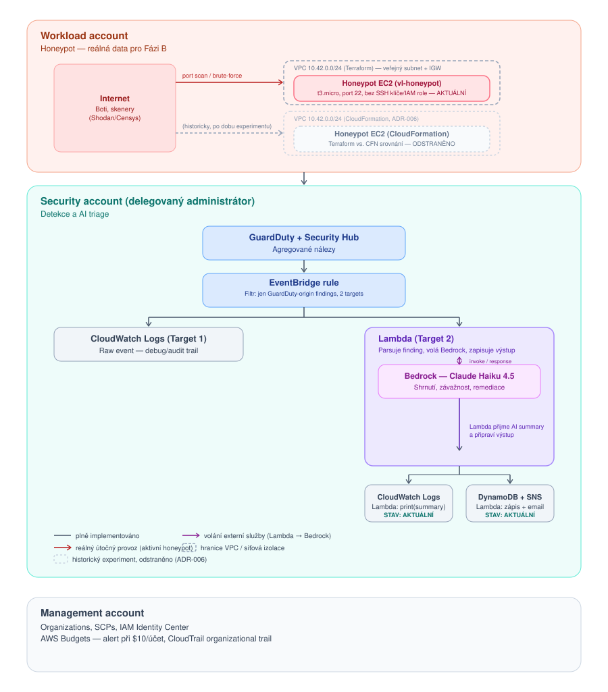

# AI-Assisted Security Operations Sandbox

Multi-account AWS architektura pro centralizovanou bezpečnostní detekci
s AI triage vrstvou (Amazon Bedrock). Portfolio projekt zaměřený na
AWS Organizations governance, delegovanou administraci a automatizované
zpracování bezpečnostních nálezů.

## Cíl projektu

- Prakticky si osahat koncepty AWS Certified Solutions Architect Professional
  (SAP-C02) a AWS Certified Security Specialty (SCS-C03) — multi-account
  governance, delegovaná administrace, centralizovaná detekce
- Vybudovat portfolio s ověřitelnými artefakty (IaC, diagramy, ADRs,
  Well-Architected review)

## Architektura



Tři AWS účty pod jednou AWS Organization:

| Účet | Role |
|---|---|
| **Management** | AWS Organizations, SCPs, IAM Identity Center, Budgets |
| **Security** | Delegovaný administrátor pro GuardDuty + Security Hub; hostí AI triage pipeline |
| **Workload** | Sandbox zdroje, kde vznikají bezpečnostní nálezy |

### Detekční a AI pipeline (Security account)

```
GuardDuty/Security Hub finding
   → EventBridge rule
   → Lambda (glue kód)
   → Bedrock (Claude Haiku) – shrnutí, závažnost, remediace
   → DynamoDB (log) + SNS (notifikace)
```

## Tech stack

- **IaC:** Terraform
- **Detekce:** Amazon GuardDuty, AWS Security Hub, AWS Config
- **AI:** Amazon Bedrock (Claude Haiku)
- **Automatizace:** EventBridge, Lambda, DynamoDB, SNS

## Konfigurace

- **AWS Region:** `us-east-1`
  _(pozn.: GuardDuty a Security Hub delegovaná administrace i CloudWatch
  billing metriky vyžadují přítomnost v us-east-1; ostatní zdroje zatím
  drženy ve stejném regionu kvůli jednoduchosti, zvážit případné
  přesunutí blíž geograficky později a zdůvodnit v ADR)

## Struktura repa

```
├── main.tf
├── modules/
│   ├── organization/         # SCPs, OUs, Budgets
│   ├── security_hub/         # Delegated admin, GuardDuty/Security Hub
│   ├── ai_triage_pipeline/   # EventBridge, Lambda, Bedrock, DynamoDB, SNS
│   └── workload_sandbox/     # GuardDuty member, honeypot (Fáze B)
├── docs/
│   ├── adr/                  # Architecture Decision Records
│   ├── architecture.svg
│   └── well-architected/     # Baseline a finální review
└── README.md
```

## Jak spustit

_TODO: doplnit po prvním funkčním `terraform apply` — providers per účet,
potřebné proměnné, prerekvizity._

## Stav projektu / timeline

| Datum | Milník |
|---|---|
| 2026-09-03 | Založena AWS Organization, Management account |
| 2026-09-03 | Security a Workload účty vytvořeny |
| 2026-09-03 | GuardDuty aktivováno (30denní free trial) |
| 2026-09-03 | Security Hub aktivováno (30denní free trial) |
| 2026-09-03 | Delegovaný administrátor nastaven (GuardDuty, Security Hub) |
| 2026-09-03 | Workload účet zapojen do GuardDuty i Security Hub scope (aktivace Security Hub musela proběhnout lokálně v účtu, ne centrálně ze Security accountu) |
| 2026-09-03 | Cesta A ověřena end-to-end: GuardDuty sample findings vygenerovány (434) a úspěšně agregovány do Security Hub (942) |
| 2026-09-04 | EventBridge rule `vl-security-hub-findings-to-log` vytvořena a ověřena — Security Hub findings se propisují do CloudWatch Logs (100+ log streamů potvrzeno) |

### Struktura Security Hub finding eventu (pro Lambda parsing)

Ověřeno na reálném (sample) eventu z EventBridge. Klíčové cesty v JSON,
které bude Lambda potřebovat pro AI triage:

| Pole | Cesta v JSON | Příklad |
|---|---|---|
| Název nálezu | `detail.findings[0].Title` | "A phishing domain name was queried by EC2 instance..." |
| Závažnost | `detail.findings[0].Severity.Label` | `HIGH` |
| Popis | `detail.findings[0].Description` | Volný text popisu incidentu |
| Účet | `detail.findings[0].AwsAccountId` | 12místné account ID |
| Typ zdroje | `detail.findings[0].Resources[0].Type` | `AwsEc2Instance` |
| Zdroj nálezu | `detail.findings[0].ProductName` | `GuardDuty` |
| Je to sample? | `detail.findings[0].Sample` | `true` / `false` |
| Odkaz do konzole | `detail.findings[0].SourceUrl` | přímý link na finding v GuardDuty |

`detail.findings` je pole — Security Hub může v jednom eventu poslat víc
nálezů najednou, Lambda musí iterovat, ne předpokládat jen jeden prvek.

## Náklady

_TODO: doplnit reálný cost breakdown po prvním měsíci provozu —
cílový rozpočet $190 (AWS Free Tier credit)._

### Security Hub v2 — přepracovaný cenový model (zjištěno 09/2026)

Security Hub nedávno přešel na nový model, kde je **Essentials plan
povinný a nerozdělitelný** — zahrnuje vulnerability management (Inspector),
posture management (CSPM) i CIEM dohromady. Jednotlivé capabilities
(vulnerability/posture management) **nejde vypnout samostatně** —
lze vypnout jen network reachability scanning zvlášť.

**Cenový mechanismus (po 30denním trialu):** $3.75 / resource unit / měsíc.

| Typ zdroje | Přepočet na 1 resource unit |
|---|---|
| EC2 instance | 1 |
| Lambda funkce | 12 funkcí |
| ECR container image | 18 images |
| IAM user/role | 125 |

**Dopad na tenhle projekt:** zanedbatelný. Bez EC2 instancí a s jednotkami
IAM rolí napříč účty je aktuální spotřeba zlomek jednoho resource unitu
(řádově centy/měsíc). Až přibude honeypot EC2 (Fáze B), počítat s
**~$3.75/měsíc paušálně za tu jednu instanci** (prorated podle aktivních
hodin), bez ohledu na její velikost nebo dobu běhu v rámci měsíce.

GuardDuty threat detection (CloudTrail/VPC Flow/DNS analýza) je oddělený
add-on mimo Security Hub Essentials trial, se svým vlastním 30denním
trialem a odděleným cenováním (per-event, per-GB) — u sandboxu s nízkým
objemem dat rovněž řádově centy.

**Potvrzeno napříč účty:** stejné chování (automatická aktivace Essentials
bundle při zapnutí Security Hub) nastává **v každém členském účtu zvlášť**
— ověřeno při zapojování Workload účtu do scope. Resource-unit pricing
se tedy počítá per účet, ne agregovaně za celou organizaci. Vzhledem
k minimálnímu počtu zdrojů v obou účtech (Security, Workload) zůstává
dopad zanedbatelný.

→ Rozhodnutí ponechat Essentials capabilities zapnuté (nelze vypnout,
náklady zanedbatelné) zdokumentovat jako ADR.

## Architektonická rozhodnutí

Klíčová rozhodnutí a jejich zdůvodnění viz [`docs/adr/`](docs/adr/).

## Well-Architected reviews

Baseline a finální review viz [`docs/well-architected/`](docs/well-architected/).
